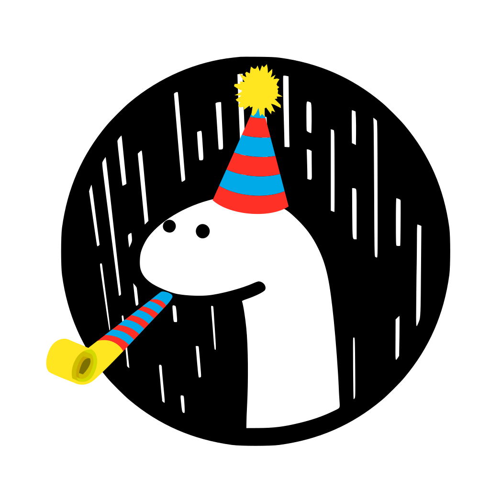

# denofun

<p align="center">
    </img>
    <p align="center">
        Small utility library for <a href="https://deno.land">Deno</a> containing functions, monads and other fun stuff.
    </p>
</p>
</br></br>

## Roadmap

⚠️ WATCH OUT!

Denofun, like Deno itself, is still under heavy development. Semver will likely NOT be strictly enforced until v1.0.0.
Denofun v1.0.0 will NOT be released until Deno v1.0.0 is released. In the meantime Denofun will try to stabilize, crush bugs and become as mature as possible. Until v1.0.0 treat this library as a curiosity. While early adopters and contributors are welcome, be wary if you want to use it somewhere you care about. For now.

### Goals

- provide a good replacement for libraries like Ramda or Lodash with "native" Deno feel
- provide basic monads (Either, Maybe/Option)
- good, out-of-the-box typings

## Documentation

Thanks to how Deno works, it's easy to start using this library.

```typescript
import compose from "https://raw.githubusercontent.com/galkowskit/denofun/master/compose.ts";
```

Denofun is also present in [deno.land](https://deno.land/) so you can use it for easier links.

```typescript
import compose from "https://deno.land/x/denofun/compose.ts";
```

You can AND SHOULD target specific versions or branches.

```typescript
import compose from "https://deno.land/x/denofun@0.3.0/compose.ts";
```

Or if you find yourself needing the transpiled JavaScript version:

```typescript
import compose from "https://deno.land/x/denofun/compose.ts?js";
```

### compose

**compose** takes a list of functions and does right-to-left function composition.

```typescript
import compose from "https://deno.land/x/denofun/compose.ts";

function greet(name: string) {
  return `hello, ${name}!`;
}

function makeLoud(x) {
  return x.toUpperCase();
}

const greetLoudly = compose(makeLoud, greet);

greetLoudly("world"); // => HELLO, WORLD!
```

### concat

**concat** adds two arrays or strings together.

```typescript
import concat from "https://deno.land/x/denofun/concat.ts";

concat("hello", "world"); // => "helloworld"
concat([1, 2, 3], [3, 4, 5]); // => [1, 2, 3, 3, 4, 5]
```

### curry

**curry** returns a curried version of the provided n-arity function, it will return new 1-arity functions until all arguments are supplied.

```typescript
import curry from "https://deno.land/x/denofun/curry.ts";

const greet = (name: string, age: number) =>
  `hello, I'm ${name} and I'm ${age} years old`;
greet("Tomasz", 26); // => hello, I'm Tomasz and I'm 26 years old

const curriedGreet = curry(greet);
curriedGreet("Tomasz")(26); // => hello, I'm Tomasz and I'm 26 years old

// ===

const cars = [
  { make: "Alfa Romeo", model: "Giulia" },
  { make: "Alfa Romeo", model: "Stelvio" },
  { make: "Ford", model: "Mustang" },
  { make: "Ford", model: "Focus" },
  { make: "Toyota", model: "Mirai" },
  { make: "Toyota", model: "Yaris" },
  { make: "Toyota", model: "Supra" },
];

const filterCarsByMake = curry((make: string, car) => car.make === make);
const filterAlfas = filterCarsByMake("Alfa Romeo");
cars.filter(filterAlfas); // => [ { make: "Alfa Romeo", model: "Giulia" }, { make: "Alfa Romeo", model: "Stelvio" } ]
```

### Either

**Either** is an interface that wraps values or Errors and can be used to:

- handle error cases without throwing and catching errors
- provide an alternative to Union types with runtime type safety and no need for typeguards

```typescript
import { Either } from "https://deno.land/x/denofun/either.ts";

function handleUnion(stringOrNumber: Either<string, number>): number {
    const value = stringOrNumber
        .map((s: string) => s.toUpperCase()) // .map() applies the function to the left value, Either is a Functor
        .left.map((s: string) => s.toLowerCase()) // but you can also use the .left shorthand for more clarity
        .right.map((n: number) => n + 1) // .right will provide a way to apply functions to the right value
        .flatMap((s) => { // Either is also a Monad, .flatMap() is also available on .left and .right
            const n = parseFloat(s);
            if (n) {
                return right(n);
            } else {
                return left(s);
            }
        });
    value.get() // => string | number
    value.coerce(parseFloat) // => number (possibly NaN), also available on .left and .right

    return value.mapEither(parseFloat, (n) => 1 / n) // => number (possibly NaN)
}

function handleError(stringOrError: Either<string, Error>): string {
    const safeString: string = stringOrError.catch((err) => err.message);
    const value: string = stringOrError.try(); // will either throw the error or return the left value
    const errorValue: stringOrError.right.try(); // will either throw a string or return an error as a value

    return safeString;
}
```

### either.error

**either.error** wraps a value in the Either interface as a right value.
`JSON.stringify()` will throw the value (ideally an Error)

```typescript
import either from "https://deno.land/x/denofun/either.ts";
// import error from "https://deno.land/x/denofun/either/error.ts"; // is also available

const numberOrError = either.error<number, Error>(new Error("message"));
numberOrError.get(); // returns the error without throwing it
numberOrError.try(); // throws the error
numberOrError.right.try(); // returns the error with strict static typing
JSON.stringify(rightString); // throws the Error
```

### either.jsonError

**either.jsonError** wraps a value in the Either interface as a right value.
`JSON.stringify()` will serialize it with its name, message, _and stack trace_, if available.

```typescript
import either from "https://deno.land/x/denofun/either.ts";
// import jsonError from "https://deno.land/x/denofun/either/jsonError.ts"; // is also available

const numberOrError = either.jsonError<number, Error>(new Error("message"));
numberOrError.get(); // returns the error without throwing it
numberOrError.try(); // throws the error
numberOrError.right.try(); // returns the error with strict static typing
JSON.stringify(rightString); // => {"name": "Error", "message": "message", "stack": "..."};
```

### either.left

**either.left** wraps a value in the Either interface as a left value;

```typescript
import either from "https://deno.land/x/denofun/either.ts";
// import left from "https://deno.land/x/denofun/either/left.ts"; // is also available

const left12 = either.left<number, string>(12);
left12.get(); // => 12 with string | number union type, but no runtime error
left12.try(); // => 12 with strict static typing but potentially a runtime error (not in this case)
left12.right.try(); // throws 12
```

### either.partition

**either.partition** partitions an array of `Either<Left, Right>` in a tuple or `Left[]` and `Right[]`.

```typescript
import { Either } from "https://deno.land/x/denofun/either.ts";
import partition from "https://deno.land/x/denofun/either/partition.ts";

const eitherValues: Array<Either<number, string>> = [
  left(1),
  left(3),
  right("hello"),
  left(0.5),
  right("0.5"),
  right("one"),
  left(NaN),
];
const [leftValues, rightValues]: [number[], string[]] = partition(eitherValues);

leftValues; // => [1, 3, 0.5, NaN]
rightValues; // => ["hello", "0.5", "one"]

leftValues.length + rightValues.length === 7; // => true
```

### either.right

**either.right** wraps a value in the Either interface as a right value.

```typescript
import either from "https://deno.land/x/denofun/either.ts";
// import right from "https://deno.land/x/denofun/either/right.ts"; // is also available

const rightString = either.right<number, string>("hello");
rightString.get(); // "hello" with string | number union type, but no runtime error
rightString.try(); // throws "hello"
rightString.right.try(); // returns "hello" with strict static typing
```

### either.tryCatch

**either.tryCatch** calls its callback argument immediately and handles any synchronous errors by returning an `Either<Type, Error>`.

```typescript
import { Either } from "https://deno.land/x/denofun/either.ts";
import tryCatch from "https://deno.land/x/denofun/either/tryCatch.ts";

const numberOrError: Either<number, Error> = tryCatch(() => {
  throw new Error("message");
});

numberOrError.get(); // returns the error as a value
numberOrError
  .map((n) => n + 1) // no-op
  .try(); // throws the error
```

### either.tryCatchAsync

**either.tryCatchAsync** calls its callback argument immediately and handles all synchronous **and** asynchronous errors by returning a `Promise<Either<Type, Error>>`.

```typescript
import { Either } from "https://deno.land/x/denofun/either.ts";
import { tryCatchAsync } from "https://deno.land/x/denofun/either/try_catch.ts";

setTimeout(async () => {
  const numberOrError: Either<number, Error> = await tryCatchAsync(() =>
    Promise.reject(new Error("message"))
  );

  numberOrError.get(); // returns the error as a value
  numberOrError
    .map((n) => n + 1) // no-op
    .try(); // throws the error
}, 1);
```

### equals

**equals** checks if two values are equal, **warning:** for non-primitives uses JSON parsing (for now).

```typescript
import equals from "https://deno.land/x/denofun/equals.ts";

equals(1, 1); // => true
equals(1, 2); // => false
equals([1, 2, 3], [1, 2, 3]); // => true
equals([1, 2, 3], [2, 1, 3]); // => false
equals(
  { make: "Alfa Romeo", model: "Giulia" },
  { make: "Alfa Romeo", model: "Giulia" }
); // => true
```

### filter

**filter** runs filter function on every element of array and returns a new array with only those elements for which filter function returned true.

```typescript
import filter from "https://deno.land/x/denofun/filter.ts";

const cars = [
  { make: "Alfa Romeo", model: "Giulia" },
  { make: "Alfa Romeo", model: "Stelvio" },
  { make: "Ford", model: "Mustang" },
  { make: "Ford", model: "Focus" },
  { make: "Toyota", model: "Mirai" },
  { make: "Toyota", model: "Yaris" },
  { make: "Toyota", model: "Supra" },
];

filter((car) => car.make === "Ford", cars); // => [ { make: "Ford", model: "Mustang" }, { make: "Ford", model: "Focus" } ]
```

### find

**find** looks up first element of an array that matches the function passed.

```typescript
import find from "https://deno.land/x/denofun/find.ts";

const cars = [
  { make: "Alfa Romeo", model: "Giulia" },
  { make: "Alfa Romeo", model: "Stelvio" },
  { make: "Ford", model: "Mustang" },
  { make: "Ford", model: "Focus" },
  { make: "Toyota", model: "Mirai" },
  { make: "Toyota", model: "Yaris" },
  { make: "Toyota", model: "Supra" },
];

function findToyota(car) {
  return car.make === "Toyota";
}

find(findToyota, cars); // => { make: "Toyota", model: "Mirai" }
```

### flatten

**flatten** takes an array of elements and flattens it by one level.

```typescript
import flatten from "https://deno.land/x/denofun/find.ts";

flatten([
  [1, 2, 3],
  [4, 5, 6],
]); // => [1, 2, 3, 4, 5, 6]
flatten([[1, [2, 3], [4, [5, [6]]]]]); // => [1, 2, 3, 4, [5, [6]]]
flatten([]); // => []
```

### groupBy

**groupBy** accepts a selector function and a list of elements, the elements will be grouped by the return value of the selector function.

```typescript
import find from "https://deno.land/x/denofun/group_by.ts";

const cars = [
  { make: "Alfa Romeo", model: "Giulia" },
  { make: "Alfa Romeo", model: "Stelvio" },
  { make: "Ford", model: "Mustang" },
  { make: "Ford", model: "Focus" },
  { make: "Toyota", model: "Mirai" },
  { make: "Toyota", model: "Yaris" },
  { make: "Toyota", model: "Supra" },
];

groupBy((car) => car.name, cars); // => { "Alfa Romeo": [ { make: "Alfa Romeo", model: "Giulia" }, { make: "Alfa Romeo", model: "Stelvio" } ], "Ford": [ { make: "Ford", model: "Mustang" }, { make: "Ford", model: "Focus" }, ], "Toyota": [ { make: "Toyota", model: "Mirai" }, { make: "Toyota", model: "Yaris" }, { make: "Toyota", model: "Supra" } ] }
groupBy((x) => x.length, ["a", "bb", "bb", "ccc"]); // => { 1: ["a"], 2: ["bb", "bb"], 3: ["ccc"] }
```

### has

**has** checks if a key exists inside an object (does NOT check the prototype's keys!).

```typescript
import has from "https://deno.land/x/denofun/has.ts";

const car = { make: "Alfa Romeo", model: "Giulia" };
has("make", car); // => true
```

### head

**head** returns the first element of an array or a string.

```typescript
import head from "https://deno.land/x/denofun/head.ts";

const numbers = [1, 2, 3, 4, 5];
head(numbers); // => 1

// ===

head("hello world!"); // => "h"
```

### identity

**identity** returns the provided element, otherwise does nothing.

```typescript
import identity from "https://deno.land/x/denofun/identity.ts";

const x = 5;
identity(x); // => 5
```

### includes

**includes** checks if an element exists in a string or array (including objects).

```typescript
import includes from "https://deno.land/x/denofun/includes.ts";

includes(1, [1, 2, 3]); // => true
includes("hel", "hello world"); // => true
includes({ make: "Alfa Romeo", model: "Giulia" }, [
  { make: "Alfa Romeo", model: "Giulia" },
  { make: "Ford", model: "Mustang" },
]); // => true
```

### keys

**keys** returns key names from a provided object.

```typescript
import keys from "https://deno.land/x/denofun/keys.ts";

const car = { make: "Alfa Romeo", model: "Giulia" };
keys(car); // => ["make", "model"]
```

### last

**last** accepts a list of items (or a string) and returns the last element (or character).

```typescript
import last from "https://deno.land/x/denofun/last.ts";

last([1, "test", 3]); // => 3
last("hello world!"); // => "!"
```

### map

**map** applies a function to each element of the array, returns the array of results.

```typescript
import map from "https://deno.land/x/denofun/map.ts";

const numbers = [1, 2, 3, 4, 5];
map((n) => n * 2, numbers); // => [2, 4, 6, 8, 10]
```

### maybe

**maybe** wraps a potentially `null` or `undefined` value in a `Maybe` type which provides
the map, flatMap, filter, and mapMaybe methods

```typescript
import maybe from "https://deno.land/x/denofun/maybe.ts";

const numbers = [1, 2, 3, 4, 5];
const maybeNumber = maybe(numbers.find((n) => n > 2));
maybeNumber.get(); // => 3
maybeNumber.map((n) => n + 1).get(); // => 4
maybeNumber.flatMap((n) => (n !== 3 ? maybe(1 / (n - 3)) : maybe())).get(); // => undefined
```

### memoize

**memoize** returns a function that remembers the result of a function with a given parameters so it can cache the previous results.

```typescript
const double = (n) => n * 2;
const memoizedDouble = memoize(double);

memoizedDouble(2); // => 4 (calculated)
memoizedDouble(2); // => 4 (cached)
```

### nth

**nth** returns element under given index, if negative index is provided element at (length + index) is returned.

```typescript
import nth from "https://deno.land/x/denofun/map.ts";

nth(2, [1, 2, 3, 4, 5]); // => 3
nth(4, "hello world!"); // => "o"
```

### omit

**omit** returns a copy of an object but without specified keys.

```typescript
import omit from "https://deno.land/x/denofun/omit.ts";

const car = { make: "Alfa Romeo", model: "Giulia" };
omit(["make"], car); // => { model: "Giulia" }
```

### partition

**partition** runs predicate on every element of input array and returns a tuple of two arrays: one where predicate returns `true`, one where predicate returns `false`.

```typescript
import partition from "https://deno.land/x/partition/partition.ts";
partition((x) => x % 3 === 0, [0, 1, 2, 3, 4, 5, 6, 7, 8, 9]); // => [[0, 3, 6, 9], [1, 2, 4, 5, 7, 8]]
```

### pick

**pick** returns a copy of an object with only the keys selected

```typescript
import pick from "https://deno.land/x/denofun/pick.ts";

const car = { make: "Alfa Romeo", model: "Giulia", doors: 5 };
pick(["make", "model"], car); // => { make: "Alfa Romeo", model: "Giulia" }
```

### pipe

**pipe** takes a list of functions and does left-to-right function composition.

```typescript
import pipe from "https://deno.land/x/denofun/pipe.ts";

function greet(name: string) {
  return `hello, ${name}!`;
}

function makeLoud(x) {
  return x.toUpperCase();
}

const greetLoudly = pipe(greet, makeLoud);

greetLoudly("world"); // => "HELLO, WORLD!"
```

### pluck

**pluck** takes an array of objects and a property name and returns an array containing the named property of each object.

```typescript
import pluck from "https://deno.land/x/denofun/pluck.ts";

const cars = [
  { make: "Alfa Romeo", model: "Giulia" },
  { make: "Alfa Romeo", model: "Stelvio" },
  { make: "Ford", model: "Mustang" },
  { make: "Ford", model: "Focus" },
  { make: "Toyota", model: "Mirai" },
  { make: "Toyota", model: "Yaris" },
  { make: "Toyota", model: "Supra" },
];

pluck("make", cars); // => [ "Alfa Romeo", "Alfa Romeo", "Ford", "Ford", "Toyota", "Toyota", "Toyota" ]
```

### prop

**prop** returns a value from object under a specific key.

```typescript
import prop from "https://deno.land/x/denofun/prop.ts";

const car = { make: "Alfa Romeo", model: "Giulia" };
prop("make", car); // => "Alfa Romeo"
```

### reduce

**reduce** applies a reductor function to all elements of the array while
keeping the aggragete of previous iterations. Returns a single value.

```typescript
import reduce from "https://deno.land/x/denofun/reduce.ts";

const numbers = [1, 2, 3, 4, 5];

const add = (a, b) => a + b;
reduce(add, 0, numbers); // => 15
```

### reverse

**reverse** reverses the order of the elements in array or string.

```typescript
import reverse from "https://deno.land/x/denofun/reverse.ts";

reverse([1, 2, 3, 4, 5]); // => [5, 4, 3, 2, 1]

// ===

reverse("hello world!"); // => ["!dlrow olleh"]
```

**slice** return a given slice of an array or string (wrapper over Array.prototype.slice)

```typescript
import slice from "https://deno.land/x/denofun/slice.ts";

slice(1, 3, ["a", "b", "c", "d", "e"]); // => ['b', 'c']
slice(1, Infinity, ["b", "c", "d", "e"]); // => ['b', 'c', 'd', 'e']
```

### sort

**sort** performs a sorting of array or string via provided sorting function.

Sorting function has to accept two arguments and retrun positive number if first argument
is bigger than second, 0 if equal and negative if lesser.

```typescript
import sort from "https://deno.land/x/denofun/sort.ts";

function sortNumbers(a, b) {
  if (a > b) {
    return 1;
  }

  if (a == b) {
    return 0;
  }

  if (a < b) {
    return -1;
  }
}

sort(sortNumbers, [5, 4, 2, 3, 1]); // => [1, 2, 3, 4, 5];

// or shorter
sort((a, b) => a - b, [5, 4, 2, 3, 1]); // => [1, 2, 3, 4, 5];
```

### split

**split** splits a string by a given deliminator/separator.

```typescript
import split from "https://deno.land/x/denofun/split.ts";

split("/", "/usr/local/bin/deno"); // => ["", "usr", "local", "bin", "deno"]
```

### tail

**tail** returns all elements of the given array or string except the first.

```typescript
import tail from "https://deno.land/x/denofun/tail.ts";

tail([1, 2, 3, 4, 5]); // => [2, 3, 4, 5]

// ===

tail("hello world!"); // => "ello world!"
```

### values

**values** returns values from a provided object

```typescript
import values from "https://deno.land/x/denofun/values.ts";

const car = { make: "Alfa Romeo", model: "Giulia" };
values(car); // => ["make", "model"]
```

## For Developers

If you want to contribute to Denofun:

1. Clone this repository.
2. Make sure you have Deno installed.
3. You can run tests with `deno test`.

Thanks!
